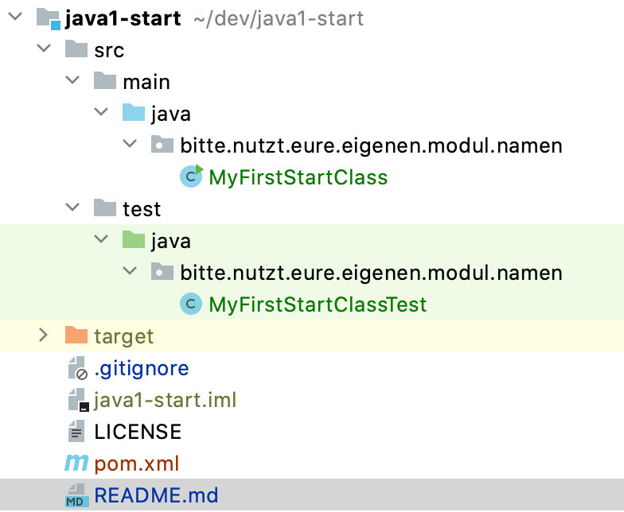
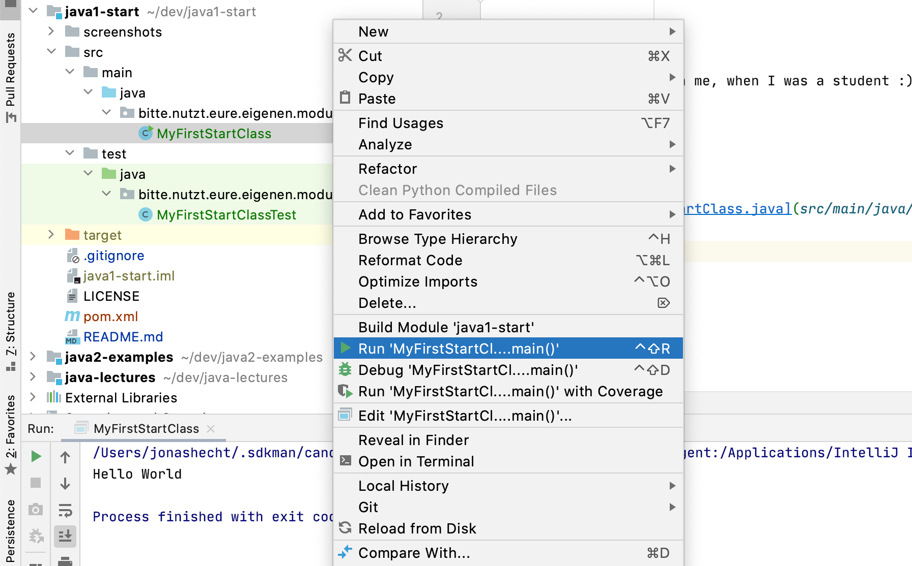

# java1-start
Example project to get you started :)

Feel free to copy [pom.xml](pom.xml) and the full `src` directory! I hope this will help you to get started much faster than me, when I was a student :)

Import both into your project. It should look like this:

Without doing anything further, you should be able to run the [src/main/java/bitte/nutzt/eure/eigenen/modul/namen/MyFirstStartClass.java](src/main/java/bitte/nutzt/eure/eigenen/modul/namen/MyFirstStartClass.java) inside Intellij with a right click on `Run`:

Now feel free to experiment and create classes, methods, variables... code! Don't forget to change the package name into something useful.

